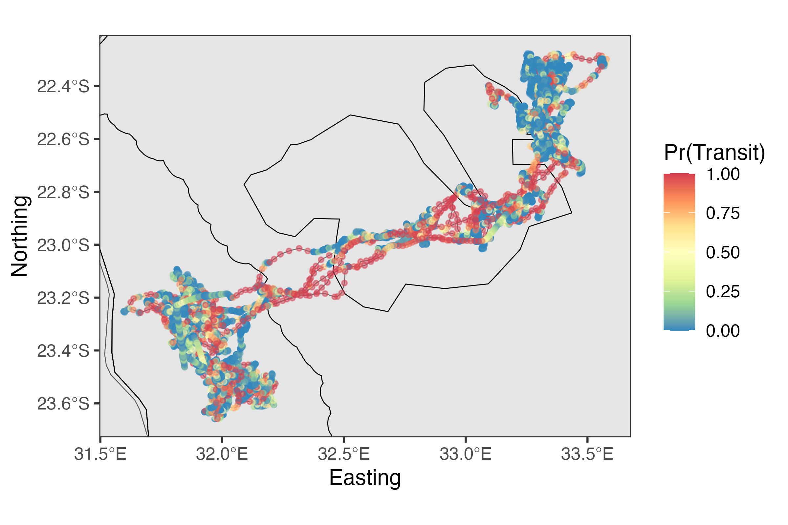
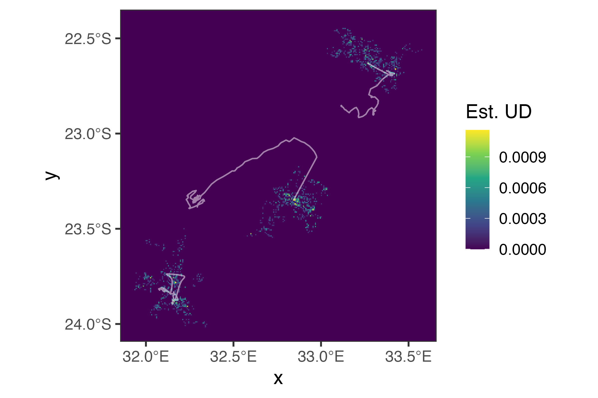
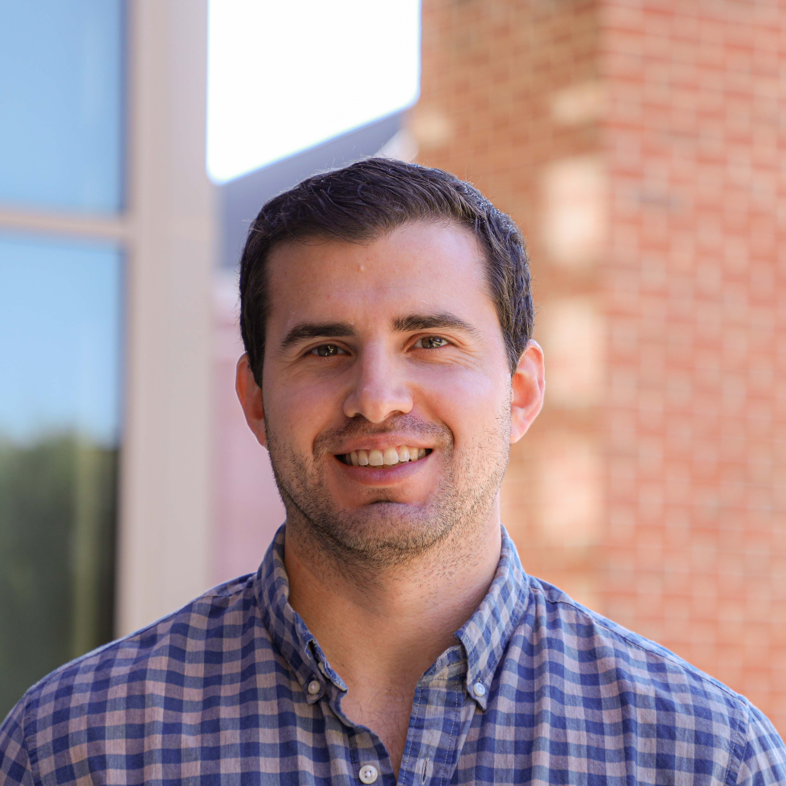

# From telemetry data to ecological inference and conservation action

A workshop developed by [Josh Cullen](https://joshcullen.github.io) in collaboration with Stellenbosch University, Wildlife Free to Roam, and NiTHeCS (National Institute for Theoretical and Computational Sciences).

------------------------------------------------------------------------

📆 &ensp;16–17 September 2026\
⏰ &ensp;8:30 - 16:30\
🏫 &ensp;Stellenbosch University, Merensky Bldg, NITheCS Seminar Room\

------------------------------------------------------------------------

::: {.callout-note}

## Note
Although this workshop is being conducted at Stellenbosch University (Stellenbosch, South Africa), these sessions will be recorded and made freely available online after the completion of the workshop. Stay tuned for when these are posted on YouTube.
:::

# Workshop overview and motivation

Animal movement ecology has advanced rapidly over the past decade, driven by improvements
in wildlife telemetry, remote sensing, environmental data products, and statistical modelling.
Modern movement analyses increasingly integrate behavioural processes, habitat selection,
and space use to address fundamental ecological questions and inform conservation planning.

This workshop provides hands-on training in contemporary movement ecology workflows using
R and introduces advanced modelling frameworks that link animal decision-making, movement
behaviour, habitat use, and conservation outcomes.

It combines conceptual lectures, practical coding sessions, and collaborative research
discussions using a real African wildlife telemetry dataset.

::: {layout-ncol=2}

:::

Additionally, a set of guidelines will be presented as to how practitioners should decide which method is best for their project and data needs. The focus of this workshop will be on GPS telemetry data for terrestrial species using the R programming language, but is also applicable to aquatic species and other forms of telemetry data.

If you have any questions, please contact me at joshcullen10 [at] gmail.com.

## Workshop goals

- Build regional capacity in modern animal movement modelling
- Bridge ecological theory with quantitative and statistical modelling
approaches
- Introduce contemporary frameworks for analysing movement, behaviour,
habitat selection and space use
- Develop practical skills in reproducible R-based telemetry workflows
- Extract environmental data from static and/or time-matched dynamic layers
- Explore emerging approaches in Bayesian modelling and machine learning
for movement ecology
- Connect movement analyses to conservation planning and management
applications
- Foster collaboration among students, researchers, conservation
practitioners, NGOs, and wildlife managers

## Who is this workshop aimed at?

- Postgraduate students in ecology, zoology, conservation biology, statistics, mathematics,
data science, and related fields
- Quantitative ecologists and wildlife researchers
- Wildlife telemetry and tracking practitioners
- Conservation NGOs and protected area managers

# Instructor

{style="float:right;padding: 0 0 0 10px;border-radius: 10%;" fig-alt="Headshot of Dr. Josh Cullen" width="400"}

Dr. Josh Cullen is an Assistant Project Scientist in the Fisheries Collaborative Program at the University of California Santa Cruz and as an affiliate in support of the NOAA Southwest Fisheries Science Center, specialising in DevOps (software development and operationalisation) and ecological research. His work focuses on developing software and operationalising ecological models to better predict near-real-time changes in marine animal distributions and to support sustainable fisheries by reducing bycatch and ship strikes of protected marine species.

As a quantitative ecologist, he uses large datasets to investigate how animals interact with their environments. His research interests include movement and population ecology, species’ ecological roles, niche partitioning and vertebrate movement patterns. He also develops interactive web applications and decision-support tools using Shiny. His work draws on quantitative and geospatial methods (including Bayesian models, state-space models, hierarchical models, multivariate ordination, and clustering) to address complex ecological questions.

Dr. Cullen holds a PhD in Wildlife and Fisheries Sciences from Texas A&M University (2019) and a BS in Biological Sciences from Clemson University (2013).

# Preparing for the workshop

Since the workshop will use a wide range of R packages, some of which require a C++ compiler, it will be best for all participants to download and ensure that all necessary software are properly installed before attending the workshop. More details can be found on the [Preparing for Workshop](workshop-prep.qmd) page of this website.
 
 

